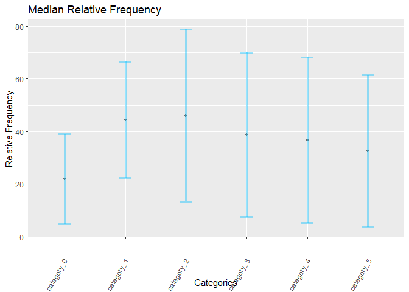

<!-- README.md is generated from README.Rmd. Please edit that file -->

# transrivalry

<!-- badges: start -->
<!-- badges: end -->

This package is used to analyze the transition data collected in the
project of “Phenomenology of Transitions in Binocular Rivalry”. These
functions organizes the data for the further statistical analysis.
Moreover, one can visualize the data and the descriptive statistics.

## Installation

You can install the released version of transrivalry from
[CRAN](https://CRAN.R-project.org) with:

``` r
install.packages("transrivalry")
```

## Preprocessing

We need to reorganize the data and combine all the data saved in
separate files.

This is a basic example for preprocessing:

``` r
library(transrivalry)
datafold <- 'tests'
csv_path <- 'tests/data.csv'
subject_list <- c('s001','s002','s003','s005','s006','s007')
basename <- 'assessments_'
data <- combine_all_subjects(csv_path,datafold,subject_list,basename,1)
```

## Descriptive statistics

To understand the nature of different transition types, we can check the
parameters including frequency, duration and speed. Descriptive stats
can give a simple insight.

This is a basic example for statistics:

``` r
library(transrivalry)
datafold <- 'tests'
csv_path <- 'tests/data.csv'
subject_list <- c('s001','s003','s005','s006','s007')
basename <- 'assessments_'
data <- combine_all_subjects(csv_path,datafold,subject_list,basename,1)
data['category_code'] <- rep(c(1,1,2,3,4),53)
data <- normalize_data(data)
all_stats <- descriptive_transition(data)
```

## Visualization

This package can also visualize the descriptives of transition data. We
can plot each parameters separately across all transition types.

This is a basic example for visualization:

``` r
library(transrivalry)
datafold <- 'tests'
csv_path <- 'tests/data.csv'
subject_list <- c('s001','s003','s005','s006','s007')
basename <- 'assessments_'
data <- combine_all_subjects(csv_path,datafold,subject_list,basename,1)
data['category_code'] <- sample(c(1,2,3,4,5),265, replace = TRUE)
data <- normalize_data(data)
all_stats <- descriptive_transition(data)
plot_stats(all_stats,'median','frequency')
```


